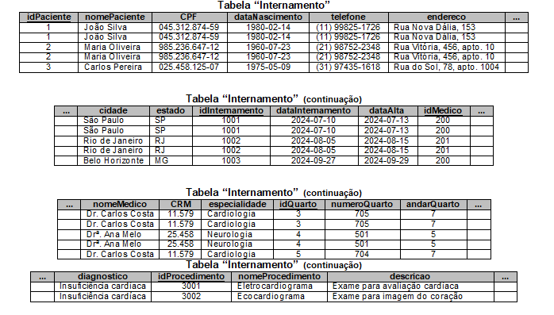
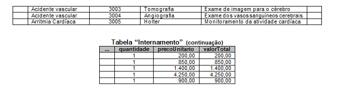
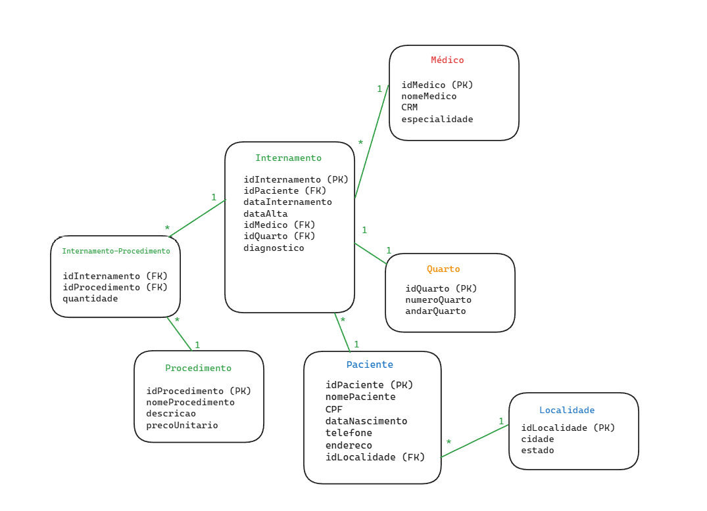

Dado o estudo de caso abaixo, aplique a Primeira Forma Normal (1FN), a Segunda Forma Normal (2FN) e a Terceira Forma Normal (3FN), demonstrando as tabelas/entidades, os campos/atributos, as chaves primárias e as chaves estrangeiras (se necessário) de cada uma das Formas Normais (FNs).

Um hospital particular necessita gerenciar os dados dos internamentos realizados. Para isso, contratou um profissional de Banco de Dados, a fim de modelar o Banco de Dados que armazenará os dados dos internamentos. Conforme levamento de requisitos realizado pelo Analista de Sistemas, a ficha do paciente para internamento contém os seguintes campos:

| Campo                     | Descrição                                     |
|---------------------------|-----------------------------------------------|
| ID do paciente            | Código único do paciente                      |
| Nome do paciente          | Nome completo do paciente                     |
| CPF                       | CPF do paciente                               |
| Data de nascimento        | Data de nascimento do paciente                |
| Telefone                  | Telefone do paciente                          |
| Endereço                  | Endereço (rua, número e complemento) do paciente |
| Cidade                    | Cidade onde mora o paciente                   |
| Estado                    | Estado onde mora o paciente                   |
| ID do internamento        | Código único do internamento                  |
| Data do internamento      | Data de entrada do paciente                   |
| Data de alta              | Data de alta/saída do paciente                |
| ID do médico              | Código único do médico                        |
| Nome do médico            | Nome completo do médico                       |
| CRM                       | CRM do médico                                 |
| Especialidade do médico   | Especialidade de atuação do médico            |
| ID do quarto              | Código único do quarto de internamento        |
| Número do quarto          | Número do quarto                              |
| Andar do quarto           | Andar onde o quarto está localizado           |
| Diagnóstico               | Diagnóstico inicial do paciente               |
| ID do procedimento        | Código único do procedimento realizado        |
| Nome do procedimento      | Nome do procedimento                          |
| Descrição do procedimento | Descrição detalhada do procedimento           |
| Quantidade                | Quantidade do procedimento realizado          |
| Preço unitário            | Preço unitário do procedimento                |
| Valor total               | Valor total (quantidade × preço unitário) do procedimento |

Para facilitar a aplicação das três Formas Normais (FNs), considere como tabela/entidade inicial a tabela “Internamento”, a qual contém a seguinte nomenclatura dos campos/atributos e os seguintes dados:

 

## Primeira Forma Normal (1FN)

<b>Objetivo:</b>
Garantir que a tabela não contenha grupos repetitivos e que cada coluna tenha valores atômicos (um valor por célula). 

<b>Problema na Tabela Inicial:</b>
Há repetição de dados, como o mesmo paciente podendo ter múltiplos internamentos e procedimentos. 

<b>Solução:</b>
Dividir os dados em tabelas separadas, cada uma com atributos relacionados diretamente.

- <u>Tabela Paciente</u>  
idPaciente (PK) | nomePaciente | CPF | dataNascimento | telefone | endereco | cidade | estado

- <u>Tabela Internamento</u>  
idInternamento (PK) | idPaciente (FK) | dataInternamento | dataAlta | idMedico (FK) | idQuarto (FK) | diagnostico

- <u>Tabela Médico</u>  
idMedico (PK) | nomeMedico | CRM | especialidade

- <u>Tabela Quarto</u>  
idQuarto (PK) | numeroQuarto | andarQuarto

- <u>Tabela Procedimento</u>  
idProcedimento (PK) | nomeProcedimento | descricao | precoUnitario

- <u>Tabela Internamento_Procedimento</u>  
idInternamento (FK) | idProcedimento (FK) | quantidade | valorTotal

## Segunda Forma Normal (2FN)

Objetivo:
Garantir que todos os atributos sejam totalmente dependentes da chave primária.

Problema:
Na tabela Internamento_Procedimento, o atributo valorTotal depende de quantidade e precoUnitario, não diretamente da chave primária composta (idInternamento, idProcedimento).

Solução:
Remover valorTotal da tabela Internamento_Procedimento, pois ele pode ser calculado com base em outros atributos.

Atualizar a tabela Internamento_Procedimento:
idInternamento (FK) | idProcedimento (FK) | quantidade

- <u>Tabela Paciente</u>  
idPaciente (PK) | nomePaciente | CPF | dataNascimento | telefone | endereco | cidade | estado

- <u>Tabela Internamento</u>  
idInternamento (PK) | idPaciente (FK) | dataInternamento | dataAlta | idMedico (FK) | idQuarto (FK) | diagnostico

- <u>Tabela Médico</u>  
idMedico (PK) | nomeMedico | CRM | especialidade

- <u>Tabela Quarto</u>  
idQuarto (PK) | numeroQuarto | andarQuarto

- <u>Tabela Procedimento</u>  
idProcedimento (PK) | nomeProcedimento | descricao | precoUnitario

- <u>Tabela Internamento_Procedimento</u>  
 idInternamento (FK) | idProcedimento (FK) | quantidade

## Terceira Forma Normal (3FN)

Objetivo:
Remover dependências transitivas (atributos que dependem de atributos que não são chaves primárias).

Problema:
Na tabela Paciente, atributos como cidade e estado podem ser normalizados para evitar redundância.

Solução:
Criar uma tabela separada para Localidade: 
idLocalidade (PK) | cidade | estado

Atualizar a tabela Paciente:
idPaciente (PK) | nomePaciente | CPF | dataNascimento | telefone | endereco | idLocalidade (FK)

- <u>Localidade</u>  
idLocalidade (PK) | cidade | estado

- <u>Tabela Paciente</u>  
idPaciente (PK) | nomePaciente | CPF | dataNascimento | telefone | endereco | idLocalidade (FK)

- <u>Tabela Internamento</u>  
idInternamento (PK) | idPaciente (FK) | dataInternamento | dataAlta | idMedico (FK) | idQuarto (FK) | diagnostico

- <u>Tabela Médico</u>  
idMedico (PK) | nomeMedico | CRM | especialidade

- <u>Tabela Quarto</u>  
idQuarto (PK) | numeroQuarto | andarQuarto

- <u>Tabela Procedimento</u>  
idProcedimento (PK) | nomeProcedimento | descricao | precoUnitario

- <u>Tabela Internamento_Procedimento</u>  
 idInternamento (FK) | idProcedimento (FK) | quantidade

## Modelo Final Normalizado

1. Paciente  
idPaciente (PK) | nomePaciente | CPF | dataNascimento | telefone | endereco | idLocalidade (FK)

2. Localidade  
idLocalidade (PK) | cidade | estado

3. Internamento  
idInternamento (PK) | idPaciente (FK) | dataInternamento | dataAlta | idMedico (FK) | idQuarto (FK) | diagnostico

4. Médico  
idMedico (PK) | nomeMedico | CRM | especialidade

5. Quarto  
idQuarto (PK) | numeroQuarto | andarQuarto

6. Procedimento  
idProcedimento (PK) | nomeProcedimento | descricao | precoUnitario

7. Internamento_Procedimento  
idInternamento (FK) | idProcedimento (FK) | quantidade

Benefícios da Normalização:  
Redução de redundâncias e inconsistências.
Dados mais fáceis de gerenciar e consultar.
Estrutura clara e escalável para futuras modificações.

