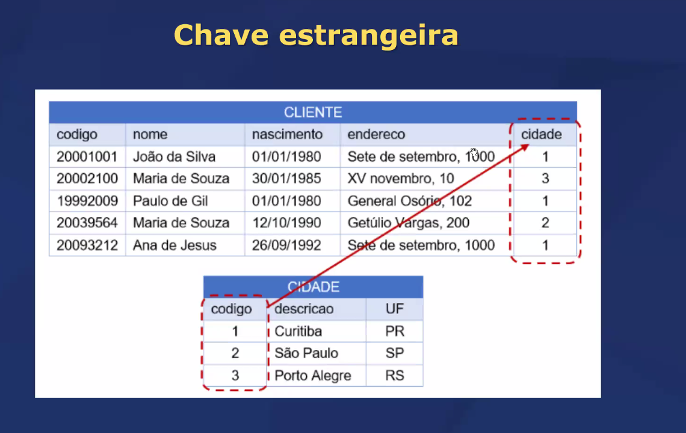
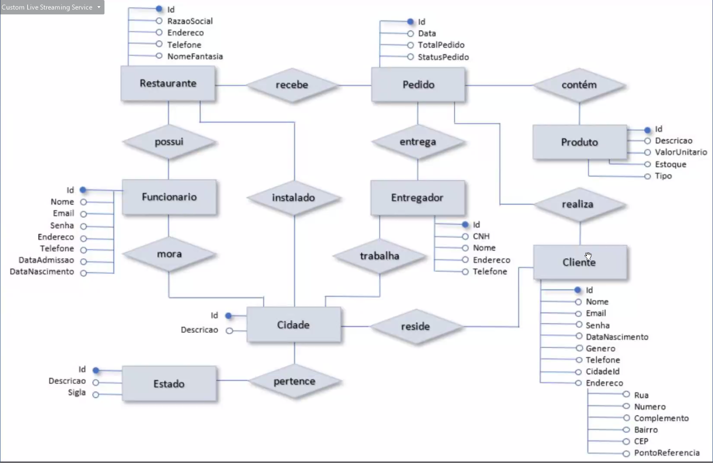

## Por que utilizar (ou não) banco de dados? 

Utilizar um banco de dados é vantajoso pela organização estruturada dos dados, garantia de consistência e integridade, segurança robusta, facilidades de backup e recuperação, controle de concorrência, e escalabilidade. Ele também proporciona métodos eficientes de consulta, como SQL. No entanto, em situações de simplicidade, onde o custo e a sobrecarga de gerenciamento são preocupações, ou onde desempenho e flexibilidade são críticos, alternativas como arquivos simples ou soluções personalizadas podem ser mais adequadas. A decisão deve ser baseada nas necessidades específicas da aplicação e na complexidade dos dados.

Objetivos da Aula: 

- Compreender aspectos principais dos Sistemas Gerenciadores de Banco de Dados;
- Compreeender aspectos principais de modelagem de dados 

## SGBD

Um Sistema de Gerenciamento de Banco de Dados (SGBD) é um software projetado para definir, criar, manipular e gerenciar bases de dados. Ele proporciona uma interface entre os usuários e as bases de dados, permitindo que os dados sejam armazenados, modificados e extraídos de forma eficiente e organizada.

## Qual a diferença entre SGBD X Banco de dados? 

### <u>SGBD (Sistema de Gerenciamento de Banco de Dados)</u>

Definição: Um SGBD é um software ou um conjunto de programas que permite criar, gerenciar e manipular bancos de dados. Ele oferece ferramentas e interfaces para a definição, inserção, atualização, exclusão e consulta de dados armazenados em um banco de dados.

Funções: O SGBD fornece funcionalidades como controle de acesso, segurança, integridade dos dados, backup e recuperação, controle de concorrência e facilidades de manutenção e administração.

Exemplos: MySQL, PostgreSQL, Oracle, Microsoft SQL Server, MongoDB.

### <u> Banco de Dados </u>

Definição: Um banco de dados é uma coleção organizada de dados que é armazenada e acessada eletronicamente. Ele pode ser visto como um repositório de dados onde as informações são estruturadas de maneira que possam ser facilmente recuperadas, gerenciadas e atualizadas.

Função: O banco de dados contém os dados reais. Ele armazena informações de forma estruturada (como tabelas em um banco de dados relacional) ou de forma não estruturada/semi-estruturada (como documentos JSON em um banco de dados NoSQL).

Exemplos: As tabelas e registros armazenados em um banco de dados MySQL, os documentos armazenados em um banco de dados MongoDB.

### <i>  Resumo da Diferença   </i> 
SGBD: É o software que gerencia e interage com os bancos de dados.  
Banco de Dados: É a coleção de dados que é gerenciada pelo SGBD.

### <u>Fases de um Projeto de Banco de Dados - Modelagem de Dados</u> 

1. Planejamento  
<u>Análise de Requisitos</u>: Coletar e analisar os requisitos dos usuários e da aplicação. Isso inclui entender os dados que precisam ser armazenados, como serão acessados, e quaisquer restrições ou requisitos de desempenho.   
Definição de Objetivos: Estabelecer os objetivos do banco de dados, incluindo metas de desempenho, segurança, e escalabilidade.

2. Análise e Modelagem de Dados  
<u>Modelo Conceitual</u>: Criar um modelo de dados de alto nível que descreve os principais dados e relacionamentos, geralmente usando diagramas entidade-relacionamento (ER).  
<u>Modelo Lógico</u>: Refinar o modelo conceitual em um modelo lógico, que detalha as tabelas, colunas, tipos de dados, e relações. Este modelo é independente do SGBD específico.

3. Projeto Físico  
Escolha do SGBD: Selecionar o Sistema de Gerenciamento de Banco de Dados mais adequado para as necessidades do projeto (por exemplo, MySQL, PostgreSQL, MongoDB).  
<u>Projeto Físico</u>: Converter o modelo lógico em um modelo físico que inclui detalhes específicos do SGBD escolhido, como a definição das tabelas, índices, procedimentos armazenados, triggers, e considerações de desempenho.
Normalização: Aplicar técnicas de normalização para minimizar a redundância e evitar problemas de inconsistência de dados.

### <u>Modelo de Entidade e Relacionamento (MER)</u> 
- Entidade: representação abstrata de um objeto do mundo real
      Queremos armazenar dados sobre elas
      Normalmente são as tabelas 
      Exemplo: Cliente, Produto, Pedido, etc.

    

 Regras para nomes das Entidades 
 - Nome único
 - Nome curto 
 - Sem espaços em branco 
 - Sem caracteres especiais

 Instância de uma Entidade 
 - São os dados em uma entidade 

 

 - Atributo: dados a armazenar sobre as entidades. Esses dados irão gerar informações 
      Normalmente são as tabelas 
      Podem ser ou não ser: <b>Nulos, Obrigatórios, Exclusivos (chaves)</b>
      - Código, nome, endereço, preço, peso, etc.

## Chave Primária
Definição: Uma chave primária é um campo (ou conjunto de campos) em uma tabela de banco de dados que identifica de maneira única cada registro dessa tabela.

### Características: 
Unicidade: Cada valor na chave primária deve ser único.

Não Nulo: Não pode haver valores nulos na chave primária. 

Identificação: É usada para identificar exclusivamente cada registro na tabela.

Exemplo: Em uma tabela Clientes, a coluna ClienteID pode ser a chave primária, garantindo que cada cliente tenha um identificador único.

## Chave Estrangeira

Definição: Uma chave estrangeira é um campo (ou conjunto de campos) em uma tabela que cria um vínculo entre os dados dessa tabela e os dados de outra tabela.
Características:
Relacionamento: Estabelece um relacionamento entre duas tabelas.
Consistência: A chave estrangeira deve corresponder a um valor existente na chave primária da tabela relacionada.
Integridade Referencial: Ajuda a manter a integridade referencial, garantindo que os relacionamentos entre tabelas permaneçam consistentes.
Exemplo: Em uma tabela Pedidos, a coluna ClienteID pode ser uma chave estrangeira que referencia a chave primária ClienteID na tabela Clientes, indicando qual cliente fez cada pedido.

### <i> Resumo </i> 

<b> Chave Primária: </b> Identifica de maneira única cada registro em uma tabela.
<b> Chave Estrangeira: </b> Cria um vínculo entre uma tabela e outra, referenciando a chave primária na tabela relacionada para manter a integridade dos dados.

### MER: 
 

 - Quais as vantagens de um BD relacional? 

 