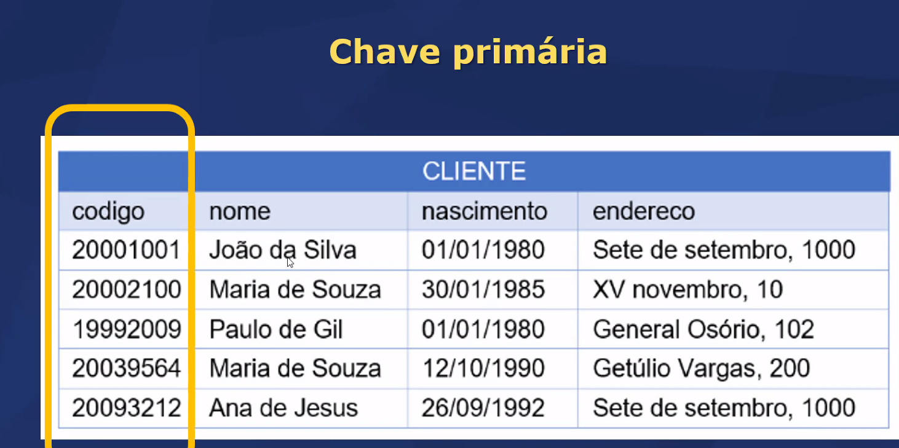
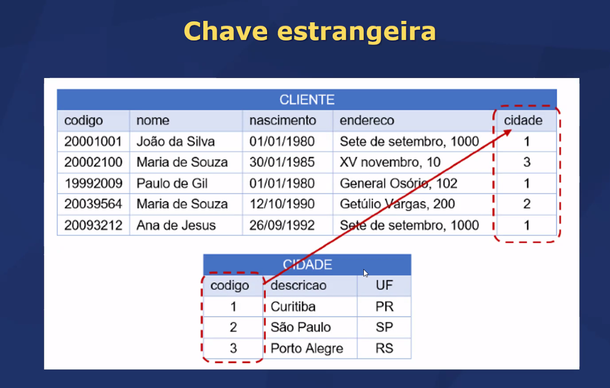
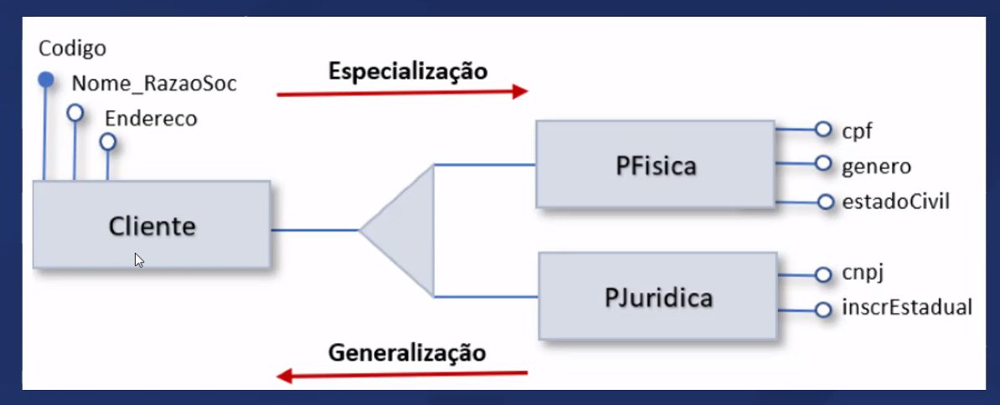

# Teoria de Base
- Chaves primátias e estrangeiras 
- Especialização e generalização 
- Cardinalidade
- Modelo lógico de dados
- Restrições de integridade

## Instância de Entidade
É o dado que vai preencher a tabela. É o dado que estamos armazenando. 

## Chave primária
- Primary Key: "PK"
- Função: identificação única de uma instância 
    - Nunca se repete (Sem duplicados)
    - Obrigatório (Sem nulos)
    - Um ou mais atributos (a chave primária pode ser uma chave composta - pode existir uma concatenação de dados)
    - Preferencialmente numérica (desempenho)

     

Repare que o código acima não se repete, é único. Ou seja, a instância "código" é a nossa PK.

CPF pode ser uma chave primária? 
- "Pode", mas não é interessante.
- Porém o CPF é um dado natural, um dado pessoal, por mais que seja um número único é interessante usar um dado que esteja inserido no contexto dos dados.

Quando não existir uma chave primária, é interessante criar uma:
- Surrogate key: chave substituta/artificial
- Melhor se for número
- Autoincremental (em geral)
    Ex: Código RU na Uninter.

## Chave estrangeira 
- Foreign Key: "FK"
- Campo de uma Entidade que faz referência a outra.
    - Pode repetir
    - Sempre é a chave primária da entidade referenciada
    - E se for composta?
        - Todos os campos vão na chave
        - É uma boa ideia usar chave composta como referência? Não, pois é não há economia de espaço, performance e desempenho comprometido.

- Vantagens:
    - Evita duplicidade de registros
    - Economiza espaço
    - Agiliza a busca

## Especialização x Generalização
- Especialização
    - Entidade com mais informações do que a entidade principal
- Generalização
    - Entidade com apenas as informações principais que similares às especializadas

# <i> Resumo </i> 

## Generalização
<b>Definição</b>: Generalização é o processo de abstrair características comuns de várias entidades em uma entidade mais geral (ou "superentidade").

<b>Objetivo</b>: O objetivo é identificar as semelhanças entre entidades e criar uma entidade que as represente de forma geral, de modo a reduzir a redundância e simplificar o modelo.

<b>Exemplo</b>: Considere duas entidades, "Carro" e "Moto". Ambas podem ser generalizadas em uma entidade mais geral chamada "Veículo", que contém atributos comuns como "marca", "modelo", "ano", etc.

<b>Entidades específicas</b>: Carro, Moto
<b>Entidade geral</b>: Veículo

## Especialização
<b>Definição</b>: Especialização é o processo inverso de generalização, onde uma entidade geral é dividida em entidades mais específicas que herdam os atributos da entidade geral e podem ter atributos adicionais próprios.

<b>Objetivo</b>: O objetivo é capturar as diferenças entre subgrupos de uma entidade mais geral, permitindo uma representação mais detalhada e específica dos dados.

<b>Exemplo</b>: Continuando com o exemplo anterior, a entidade "Veículo" pode ser especializada em "Carro" e "Moto", onde "Carro" pode ter atributos específicos como "número de portas" e "Moto" pode ter atributos específicos como "tipo de guidão".

<b>Entidade geral</b>: Veículo
<b>Entidades específicas</b>: Carro, Moto

## Cardinalidade
- Quantos de quem?
    - Um cliente faz quantos pedidos?
    - Um restaurante tem quantos clientes?
    - Um cliente faz um pedido em quantos restaurantes?

Um cliente pode fazer varios pedidos, entao a relacao entre uma entidade Cliente e uma entidade Pedido sera de 1 para Muitos (1-N)  (1-*). 

### Um para um (1:1)
- Chave estrangeira ficará aonde? 
    - Nesse caso, tanto faz. Posso colocar o código da pessoa no passaporte o código do passaporte na entidade da pessoa.
- Poderiam ser dados de uma mesma entidade?
    - Sim!

 

### Um para um (1:n)
- A chave estrangeira ficará aonde? 
    - No lado que tem N, no lado que tem muitos
- Poderiam ser dados de uma mesma entidade?
    - Não! Irá ter duplicidades e repetição de informações. Teriam muitas conquistas numa mesma entidade.

