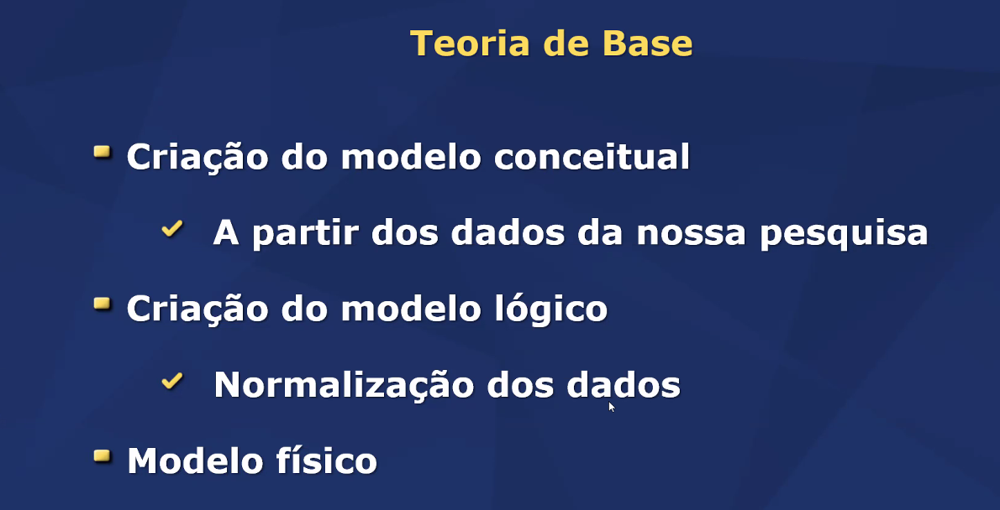
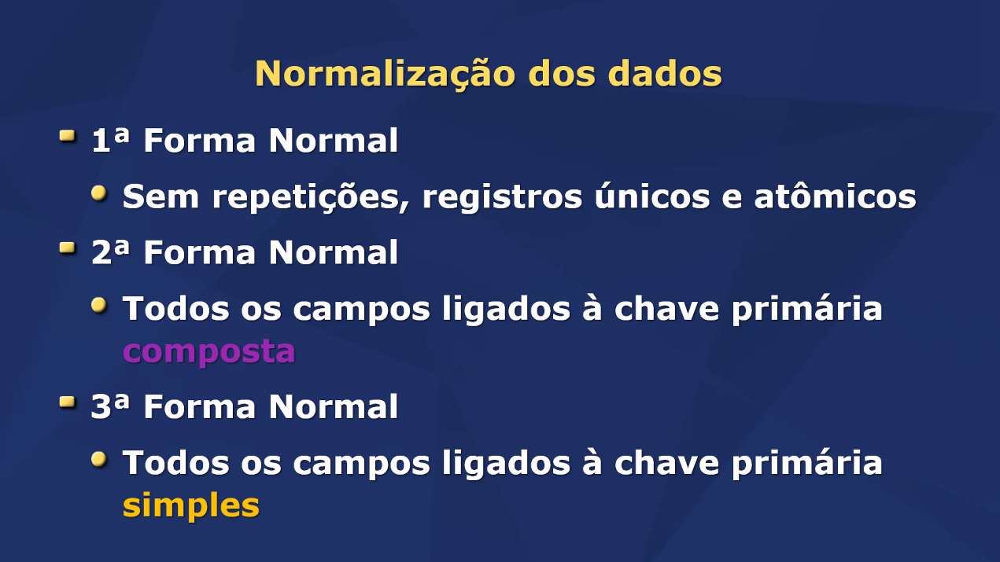

# Objetivo da aula 
- Relembrar e aplicas a criação de um modelo conceitual 
- Relembrar e aplicar o processo de normalização e da criação do modelo lógico a partir do conceitual 
- Conhecer o modelo físico 
- Criar um banco de dados a partir do modelo físico  

## Entidades 
- Representam coisas do mundo real
- Dados apenas sobre si mesmas 

## Relacionamentos
- Relação entre as coisas
- Dados dessa relação entre as entidades 

 

 

1 Forma normal 
- Separa campos com mais de um dado
- Criar campo de identificação 
- Criar relação para dados repetitivos

2 Forma Normal 
- Criar novas relações quando um atributo depende de só parte da chave primária
    - Se não tiver chave composta, já está na 2 forma normal

3 Forma Normal 
- Remover campos de "total" e outros calculos
- Realocar atributos em novas relações quando eles não dependem só da chave primária

## Modelo Físico 
- Implementação 
    - Varia (um pouco) conforme o SGBD
        - Arquivo físico
            - Organizado em tabelas pelo SGBD 
            - Dados
            - Metadados (dicionário de dados)
        - Suporte a tipos de dados específicos
            - VACHAR
            - INT, SMALLINT, TINYINT...
            - DATETIME
            - etc 
    - Outras funcionalidades como:
        - Index: índice para comparação de ID
        - View: Consulta frequente
        - Trigger: Disparo de ação
        - Procedure: Procedimento frequente

