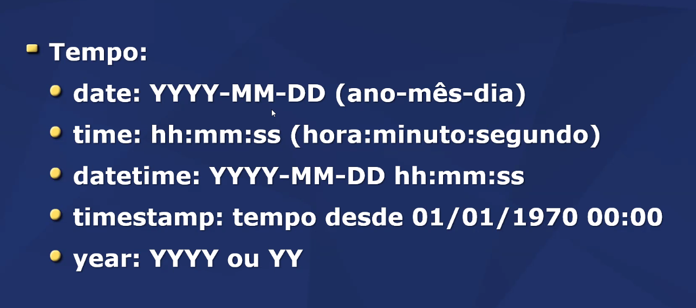

# Comandos para exportar o modelo físico

 

    Next > next > (script SQL) 

# Objetivo da aula 
- Conhecer o processo de criação de um banco de dados no servidor
- Conhecer os conceitos básicos da linguagem SQL
- Conhecer os comandos CREATE, DROP, TRUNCATE, ALTER e ADD

## SQL - Structured Query Language (Linguagem de consulta estruturada)
- Divisões e dialetos
- Tipos de dados 

### Divisões:

## SQL - ANSI
- Ansi = American National Standart Institute
- Comandos padronizados
    - Dialetos são "recursos extras"
- Consulta rápida:
    - https://www.w3schools.com/sql/sql_ref_keywords.asp  

## Boas práticas

Comando só em maiscula? Não.
- -- Comentário de linha  
- /* Comentário  
de bloco */ 
- Fim do comando com ponto-virgula ; 

## Tipos de dados

## Comandos Principais

- CREATE - criar
- DROP - dropar (remover)
- TRUNCATE - truncar 
- ALTER - alterar
- ADD - adicionar

### CREATE 

Criar? O que?
- DATABASE - Criar um database
- TABLE - Criar uma tabela
- INDEX - Criar um indice
- PROCEDURE - Procedimento 

CREATE DATABASE nomeDB;

CREATE nomeTable (  
    ...campos...  
); 

 
 

 
 

