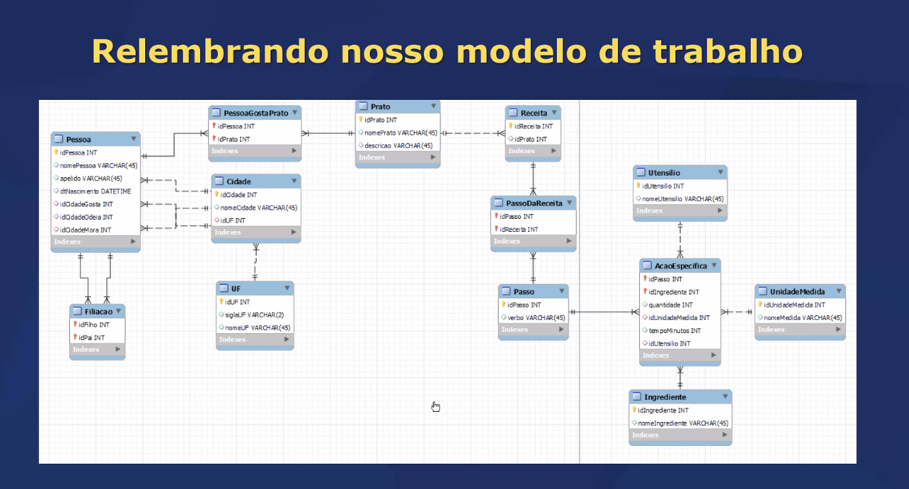

# Acolhimento conceitual

- Quais comandos SQLs vocês já conhecem? 
- Referência para comandos:  
    https://www.w3schools.com/sql/sql_ref_keywords.asp  

## Objetivo da Aula
- Conhecer os comandos SHOW, USE e DESCRIBE
- Conhecer mais a fundo as restrições das chaves primárias e estrangeiras
- Conhecer o comando de inserção INSERT 

## Comando SHOW 
- Lista os bancos de dados existentes nesta conexão 

show databases; 

## Comando USE
- USE < nome do banco >;
    - Marca o BD como em uso 

## Comando DESCRIBE
- DESCRIBE < tabela >;
    - Mostra os campos da tabela (metadados!)

## Chaves e restrições
Na criação do banco de dados é preciso colocar restrições. Se um usuário tentar deletar/atualizar algo qual tipo de restrição retornará.

- DEFAULT: define um valor padrão

- É uma restrição, pode ser removida

- Restrições de integridade
    - Existe apenas nas chaves estrangeiras

 

Os camandos ON DELETE e ON UPDATE ocorrem em conjunto com os comandos abaixo:

- ON DELETE: ao excluir
- ON UPDATE: ao atualizar
-  ++++ 
- CASCADE: atualiza/apaga em cascata 
- NO ACTION: não faz nada e acusa erro
- RESTRICT: não faz nada e acusa erro 
- SET NULL: marca como nulo 

 

- UNIQUE KEY: restrição de unicidade
    - Mas na prática é um índice
Diferença para a PRIMARY KEY?
- Não identifica o registro, apenas não se repete (tipo CPF, numero CNH, endereço de e-mail, código de produto...)
- Pode haver mais de uma UK (Unique Key) por tabela

 

 

CREATE TABLE Usuarios (  
    id INT PRIMARY KEY,  
    nome VARCHAR(100),  
    cpf CHAR(11) UNIQUE  
);

- AUTO INCREMENT: incremento automático 
    - Sempre é UNSIGNED (sem sinal = positivo)
    - Normalmente em primary key (ID)

 

## Comando INSERT
- INSERT: Insere dados no BD
- Regras: 
    - Valores do tipo caractere entre aspas simples
    - Datas entre aspas simples e no formato AAAA-MM-DD
    - Valores numéricos sem aspas
    - Pode usar NULL se o campo permitir

 
OBS: valores sempre separados por vírgula

Precisa NOT null se eu definir um valor padrão com DEFAULT?  
<b> Não. </b>

