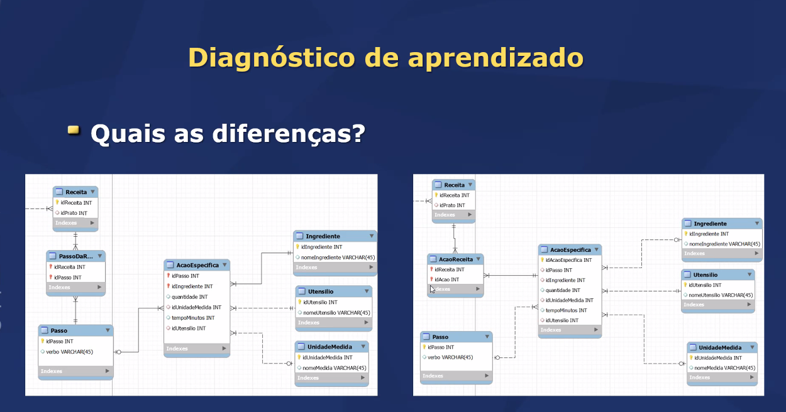
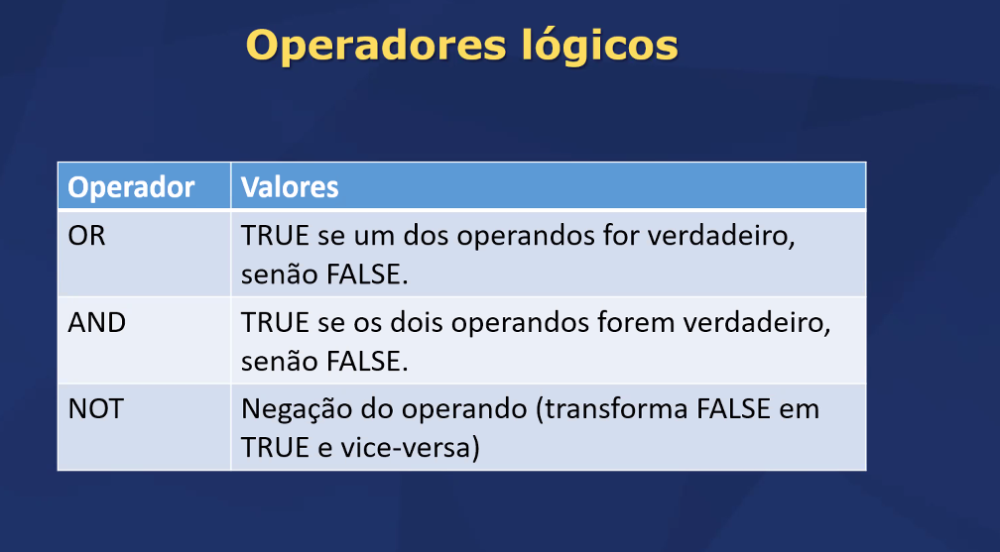
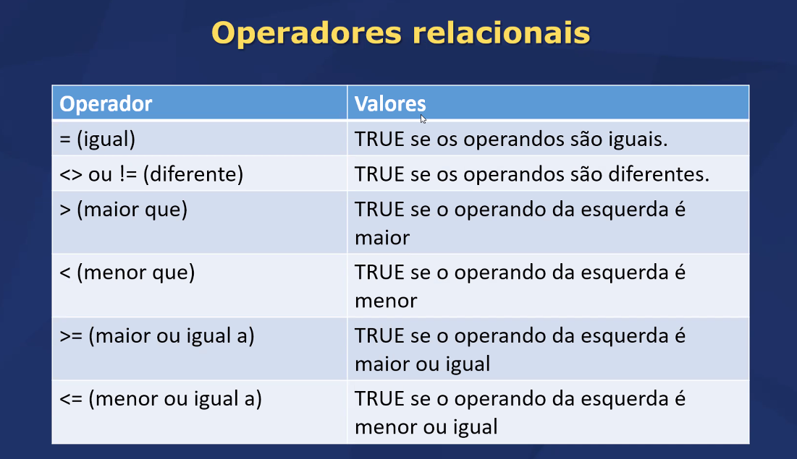
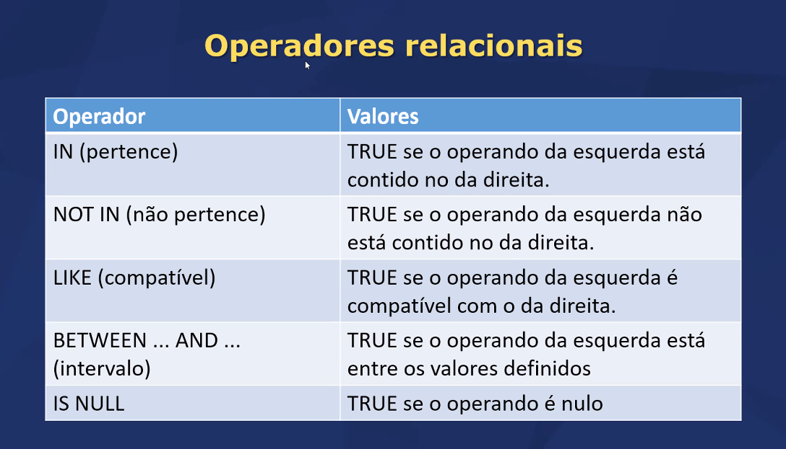
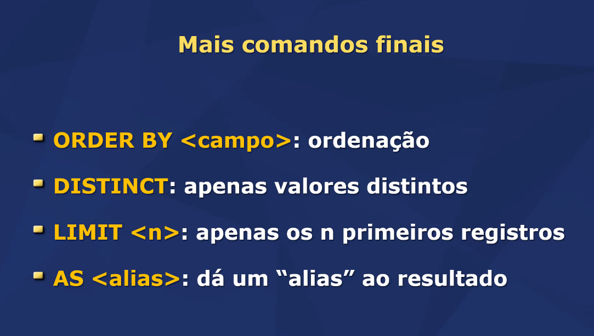
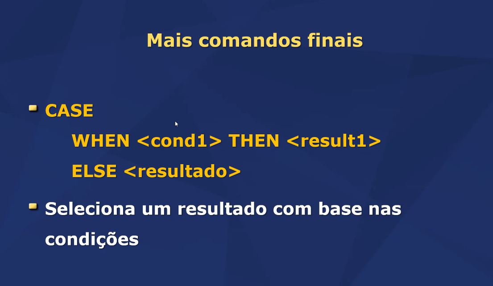
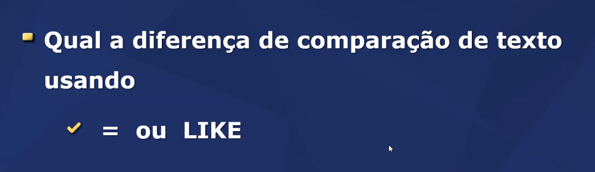
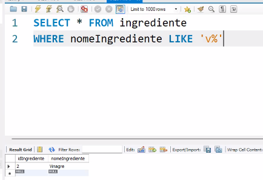

# Modelo Antigo X Modelo Novo

Objetivo da Aula 

- Conhecer os comandos de exclusão e atualização de registros

## Exclusão de registros 
- DELETE FROM tabela 
WHERE <condições>   (pode fazer um delete sem condições , assim vc apaga os registros da tabela, muito cuidado)

- ON DELETE 
    - CASCADE (apagar em cascata, vai apagar tudo que referencia aquele registro)
    - NO ACTION (não vai apagar)
    - SET NULL (o que estava apontando para aquele registro aparecerá como null)

## DELETE sem WHERE?

(=TRUNCATE) DEMISSÃO!! kkkk

## Atualização de registros 

- UPDATE FROM tabela 
WHERE<condições>  (pode fazer um update sem condições) 

## SELECT

SELECT <campos, campos ou *> FROM tabela WHERE <condições>

## Operadores Condicionais: NO WHERE COLOCO CONDIÇÕES

## Operadores Relacionais

## Operadores Aritméticos 

- Substração: - 
- Soma: + 
- Multiplicação: * 
- Divisão: /

## Mais comandos finais
 

 

Em SQL, o operador = é usado para comparar valores exatos entre duas expressões, enquanto o operador LIKE é utilizado para comparar padrões de texto, permitindo o uso de curingas como % para representar zero ou mais caracteres e _ para um único caractere. O operador = é ideal para comparações precisas e diretas, como números ou strings que devem corresponder exatamente. Por outro lado, LIKE é útil quando se deseja filtrar registros com base em padrões parciais ou específicos dentro de textos, facilitando buscas por substrings ou expressões que seguem um formato específico.

O like não é case sensitive, ou seja, ele não verifica se o texto começa com letra maiuscula ou minuscula

 

