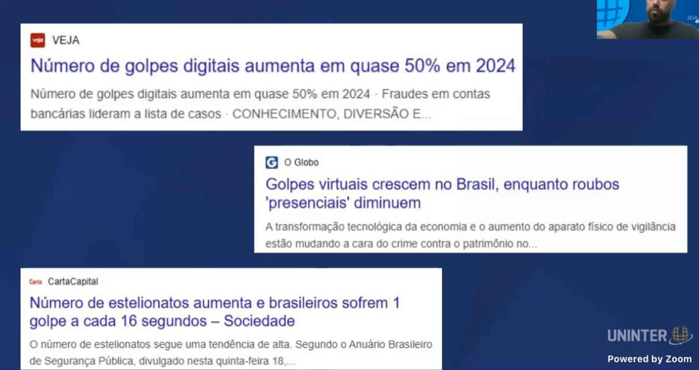
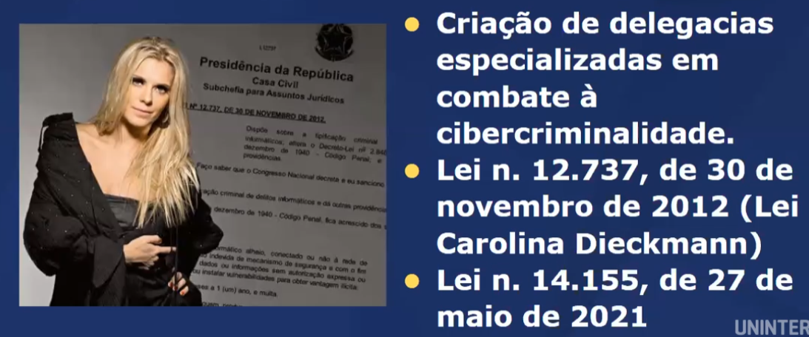

# Quais são os principais campos de estudo do Direito? Como estes temas interagem com o Direito Cibernético?
- Direito Penal 
    - Corresponde ao corpo de normas jurídicas destinado ao combate à criminalidade, garantindo a defesa da sociedade de acordc com o Código Penal. Foi constituído em 1940. Lei 2.848 de 7 de dezembro de 1940.

    

    - Outros crimes também ganharam força no ambiente digital: crimes raciais praticados em redes sociais, disseminação de pornografia infantil, dentre outras condutas que ferem a dignidade da pessoa humana e violam os direitos humanos.

    

- Direito Civil 
    - O Direito Civil é o ramo do direito privado que regula as relações entre indivíduos, abrangendo normas sobre pessoas, bens, obrigações, contratos e família. Ele busca garantir a segurança jurídica, disciplinando direitos e deveres na vida cotidiana. Seu principal código no Brasil é o Código Civil (Lei nº 10.406/2002).

    - A relação entre Direito Civil e TIC (Tecnologia da Informação e Comunicação) envolve principalmente questões sobre proteção de dados, contratos digitais, responsabilidade civil e direitos do consumidor. Com o avanço da tecnologia, surgiram desafios jurídicos relacionados a privacidade, segurança da informação e validade de transações eletrônicas. No Brasil, o Código Civil regula contratos digitais e a responsabilidade por danos causados no ambiente virtual, enquanto a LGPD (Lei Geral de Proteção de Dados – Lei nº 13.709/2018) protege os direitos dos titulares de dados pessoais.
- Direito do Consumidor
    - O Direito do Consumidor e a TIC (Tecnologia da Informação e Comunicação) estão fortemente conectados, principalmente devido ao crescimento do comércio eletrônico, serviços digitais e proteção de dados. No Brasil, o Código de Defesa do Consumidor (CDC – Lei nº 8.078/1990) regula relações de consumo, garantindo direitos como transparência, segurança e atendimento adequado em compras online. Além disso, a LGPD (Lei Geral de Proteção de Dados – Lei nº 13.709/2018) assegura a privacidade dos consumidores, exigindo que empresas protejam dados pessoais. Questões como fraudes online, direito de arrependimento e termos de uso de plataformas digitais são temas cada vez mais relevantes nesse cenário.

- Direito do Trabalho
    - O Direito do Trabalho e a TIC (Tecnologia da Informação e Comunicação) estão interligados, especialmente com o avanço do trabalho remoto, controle digital da jornada e novas formas de contratação. A CLT (Consolidação das Leis do Trabalho – Decreto-Lei nº 5.452/1943) já contempla regras sobre teletrabalho (artigos 75-A a 75-E), exigindo acordos claros entre empregador e empregado sobre responsabilidades e infraestrutura.
    - Além disso, TIC impacta monitoramento de funcionários, proteção de dados trabalhistas (conforme a LGPD), uso de inteligência artificial na gestão de RH e a gig economy, onde trabalhadores atuam por aplicativos sem vínculo formal. Essas mudanças geram debates sobre direitos, deveres e adaptações na legislação trabalhista.

