## 📔 Sobre [Mongo DB](https://www.mongodb.com/pt-br 'Mongo DB Portuguese Source')
- Banco de dados NoSQL orientado a documentos.
- Grandes volumes de dados, escalabilidade horizontal e modelagem flexível. 
- Não exige um esquema. 
- Permite que os documentos sejam armazenados em formato BSON (Binary JSON), proporcionando uma estrutura semiestruturada. 

### ✨ Vantagens 
- Flexibilidade na modelagem de dados. 
- Escalabilidade horizontal para ligar com grandes volumes de dados.
- Consultas ricas e suporte a consultas complexas.
- Alta disponibilidade e tolerância a falhas.
- Comunidade ativa e recursos de suporte.

### ✨ Desvantagens
- Menor consistência imediata em comparação com bancos de dados relacionais.
- Consultas complexos podem exigir um maior conhecimento e planejamento adequado.
- Maior consumo de espaço de armazenamento em comparação com bancos de dados relacionais devido à flexibilidade dos documentos.

### ✨ Onde o MongoDB é usado
- Aplicações web: Onde a flexibilidade e a escalabilidade são cruciais para lidar com volumes variáveis de dados.
- Análise de big data: Análise de grandes volumes de dados não estruturados ou semiestruturados: Permite a inserção de documentos com estruturas diferentes em uma mesma coleção.
- Casos de uso de geolocalização: Com suas funcionalidades de consulta geoespacial, é adequado para casos de uso que envolvem dados baseados em localização, como aplicativos de mapeamento e rastreamento. 

## 📔 Estrutura do MongoDB 

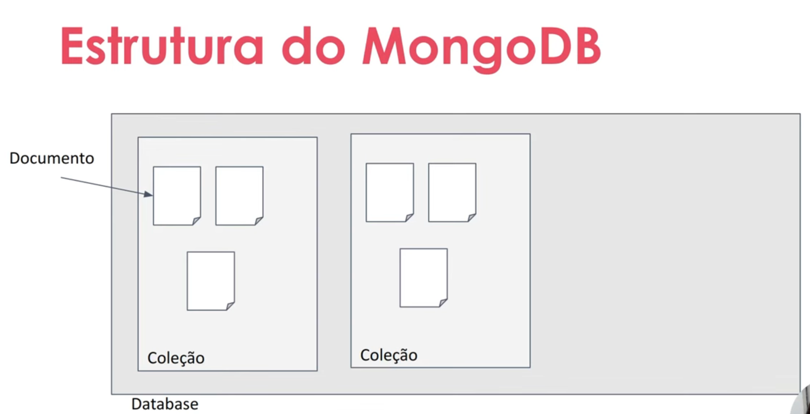

### ✨ Coleções 
- Agrupamento lógico de documentos
- Não exige esquema ou que os documentos tenham a mesma estrutura 

### ✨ Características 
- Os nomes das coleções devem seguir algumas regras:
- Devem começar com uma letra ou um underscore (_)
- Podem conter letras, números ou underscores
- Não podem ser vazios.
- Não podem ter mais de 64 bytes de comprimentos

### ✨ Documentos
- São armazenados em documentos BSON (Binary JSON), que são estruturas flexíveis e semiestruturadas.
- Cada documento possui um identificador único chamado ”_id”
- É composto por pares de chaves e valores.
- Tamanho máximo: Cada documento no MongoDB pode ter um tamanho máximo de 16 MB
- Aninhamento de documentos
- Flexibilidade na evolyção do esquema 

### ✨ Tipos de Dados Simples
- String
- Number
- Boolean
- Date
- Null
- ObjectId (Object Id)

### ✨ Tipos de Dados Complexos
- Array
- Documento Embutido (Embedded Document)
- Referência (Reference)
- GeoJSON 

## 📔 Estrutura de um documento

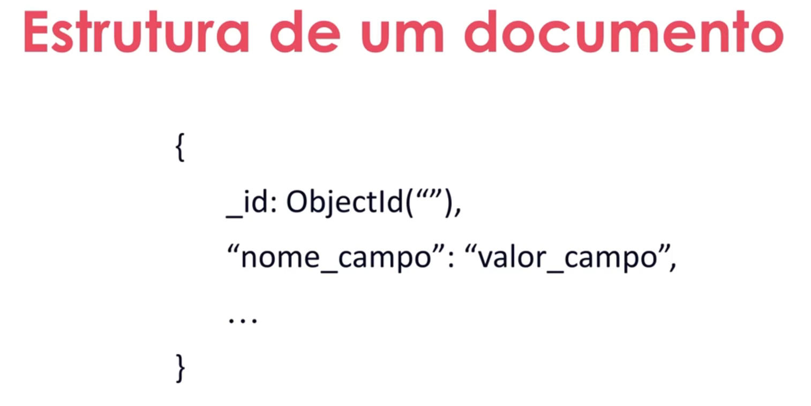 

### ✨ Modelagem orientada por consultas
- A modelagem de dados no MongoDB deve ser orientada pelas consultas que serão realizadas com mais frequência. 

### ✨ Estrutura Inner Documents 

No MongoDB, é comum **denormalizar** os dados para evitar operações de junção (join) custosas. Isso significa que os dados relacionados podem ser armazenados juntos em um único documento, em vez de serem distribuídos em várias coleções.

**_Quando usar:_**

- Os dados aninhados são específicos para o documento pai.
- Os dados aninhados são sempre acessados juntamente com o documento pai.
- A cardinalidade do relacionamento é um-para-muitos (um usuário pode ter várias reservas).

**_Quando <mark> NÃO</mark> usar:_** 

- Se os dados aninhados precisarem ser consultados e atualizados independentemente do documento pai, é mais adequado utilizar coleções separadas.
- Forma de relacionar os documentos entre si.

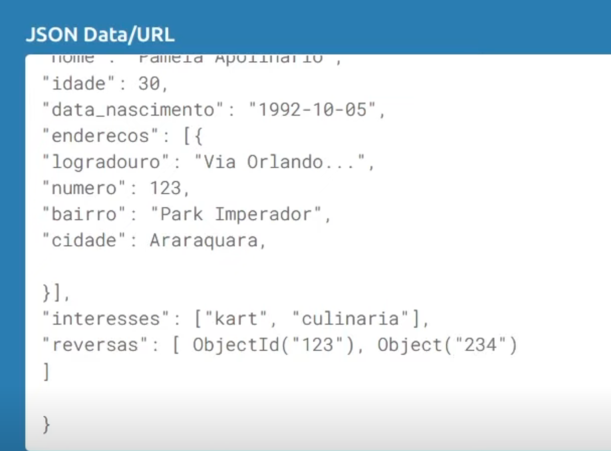 
**OBS: Veja acima os ObjectId aninhados como array. ObjectId dentro do pai.**

### ✨ Estrutura por Referencia 

Coloca-se a referencia de ObjectId como valor das chaves, referenciando a informação que queremos no filho. A informação é referencia de outra coleção, ou seja, do seu pai.

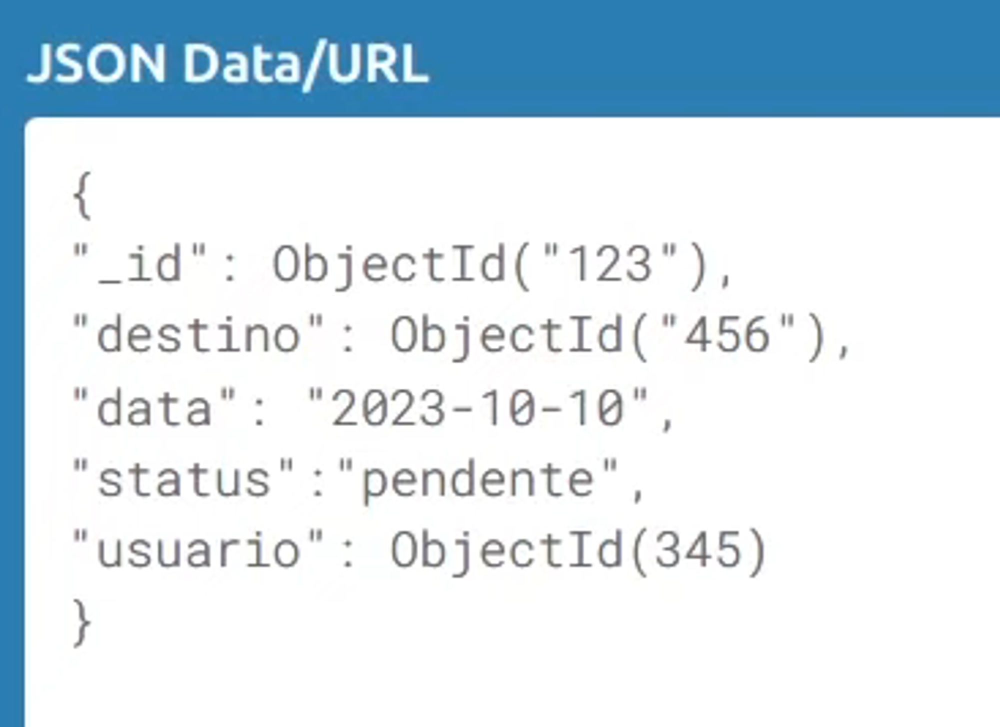 

**_Quando usar:_** 

- Os dados têm seu próprio significado e podem ser acessados independentemente do documento pai.
- Os dados têm uma cardinalidade mais alta (por exemplo, vários usuários podem ter reservas).

**_Quando <mark>NÃO</mark> usar:_**

- Se os dados aninhados precisarem ser consultados e atualizados independentemente do documento pai, é mais adequado utilizar coleções separadas.

---  
### ✨ Criando um DataBase

use {{nome_do_banco}}]

Enquanto o database não tiver uma collection ele não será apresentado na lista.

### ✨ Criando uma Collection

db.createCollection(”usuarios”)

db.createCollection(”destinos”)

### ✨ Inserindo Documentos

db.usarios.insertOne({})

db.usuarios.insertMany([{}]) 

--- 

### ✨ Inserindo Documentos - Métodos

---

#### db.usuarios.find({});
    
    É como se fosse um select all (no sql select *). Eu puxo todos os dados dentro da collection de acordo com o criterio de busca.  
    
    Exemplo: db.usuarios.find({”nome”=”João”});
    
    Vai retornar todos os usuários com nome João.

#### db.usuarios.findOne({});
    
    No qual ele vai trazer a primeira referencia que ele localizar naquela collection de acordo com o criterio de busca especificado.
    
    Exemplo: db.usuarios.findOne({”nome”:”Pamela”}); 
    
    Irá retornar  o primeiro documento registrado com o usuário Pamela pela ordenação natural do Mongo.   

#### db,usuarios.findOneAndUpdate({},{});
    
    O método findOneAndUpdate é possível consultar o dado a partir do nosso criterio de busca e ao mesmo tempo fazer uma atualização do dado.
    
    Exemplo: db.usuarios.findOneAndUpdate({”nome”:”Pamela”}, {$set: {”nome”: “Pamela Apolinario”}}); 
    
    db.usuarios.findOneAndUpdate({”nome”:”Pamela”}, {$set: {”idade”: “30”}});

    Irá retornar  o primeiro documento registrado com o usuário Pamela ao mesmo tempo irá atualizar o nome Pamela. 

#### db,usuarios.updateMany({},{});

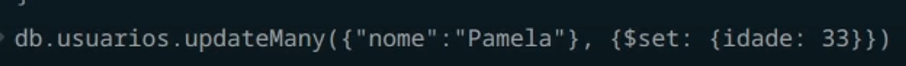

    O método acima altera a idade de TODAS as Pamelas existentes na coleção.

    É possível também, como o exemplo acima, adicionar em todas as Pamelas uma informação de interesses. 

#### db.usuarios.findOneAndDelete({});
    
    Esse método é possível excluir os dados e ele retorna quais dados foram excluídos. 

### Excluindo Documentos - Métodos

---

- db.usuarios.deleteOne({});
- db.usuarios.deleteMany({});

### Operadores

#### Igualdade: 
- Realizar consultas baseadas em um valor especifico para um campo. 

    db.usuarios.find({"endereco.cidade": "São Paulo"})

#### Operadores Lógicos 
- Realizar consultas naseadas em um valor específico para um campo. 
  - $and
  - $or 
  -$not 

#### Operadores Comparação 
- $eq: == 
- $ne: != 
- $gt: >
- $gte: >= 
- $lt: < 
- $lte: <=
- $in: []  -> $in: verifica dentro de um array os possíveis valores de igualdade
- $nin: [] -> $nin: faz a negação de valores de igualdade dentro de um array

## Alguns exemplos de operadores:

**Operador $and:** 
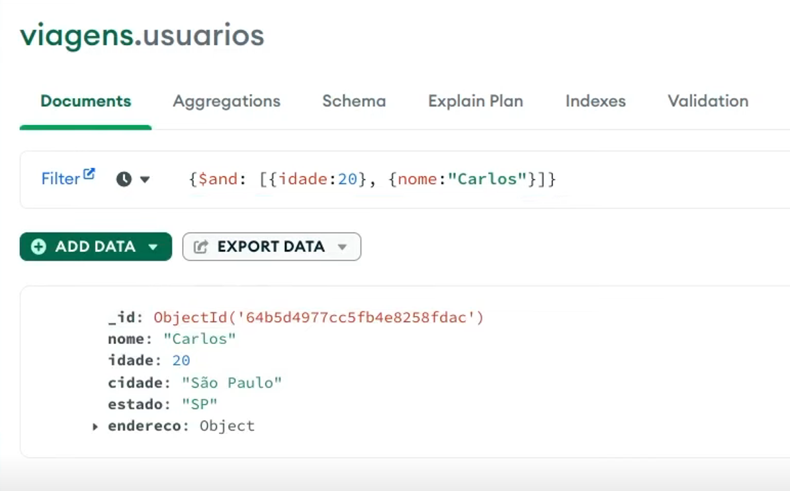

**Operador $eq:** 
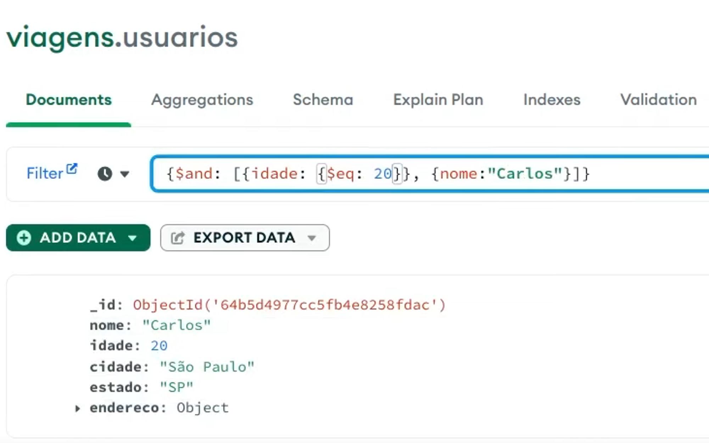

**Operador $ne:**
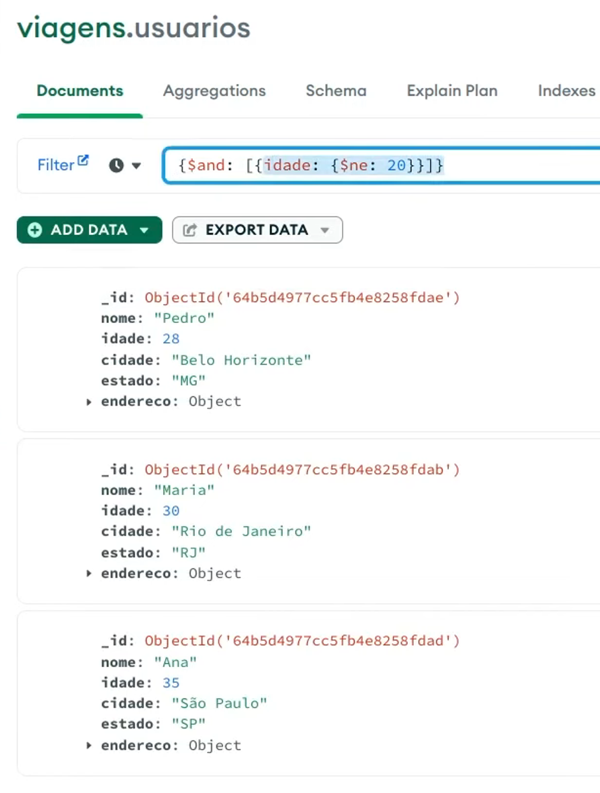 

**Operador $or:**
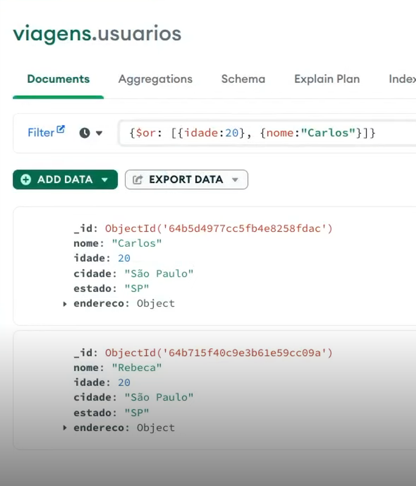 
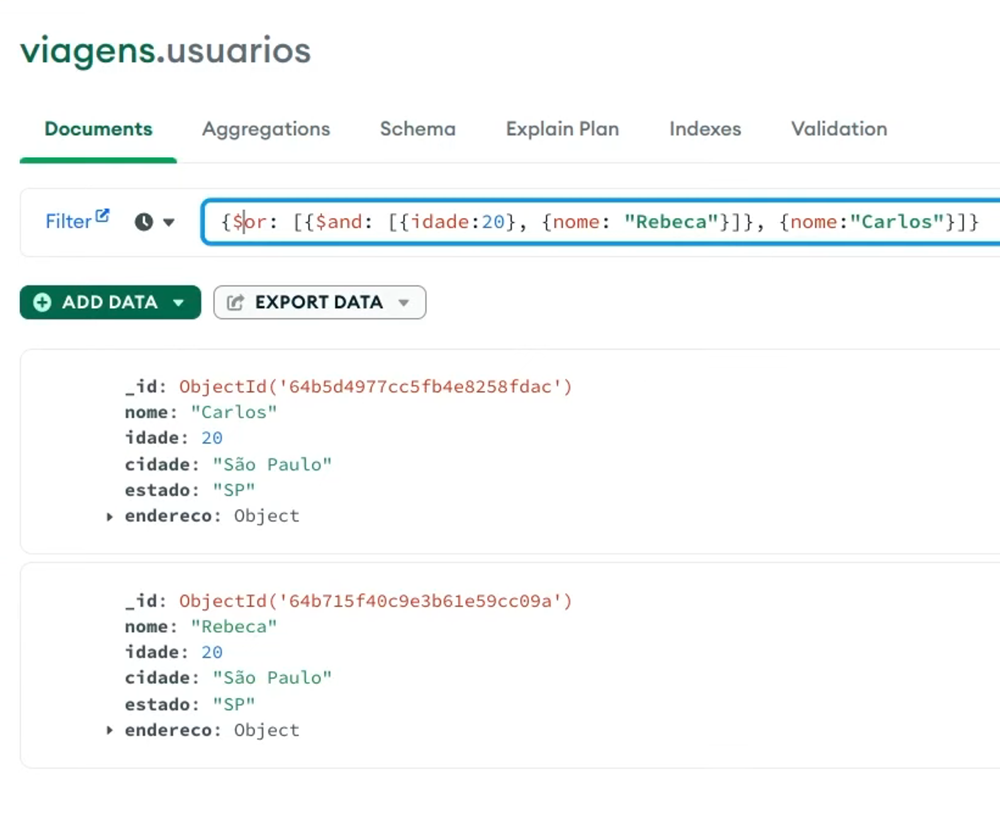

**Operador $gt:**
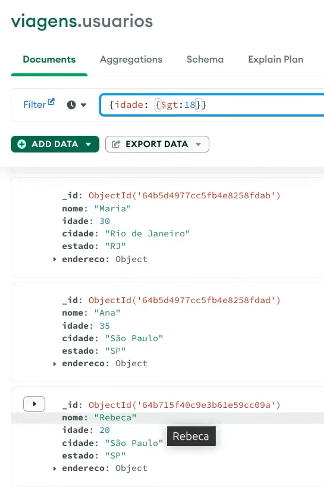

### Projeções

---

Definir quais campos devem ser retornados em uma consulta.

### Ordenação

---

Ordenar os resultados de uma consulta com base em um ou mais campos. (Asc, Dec.)

### Limitação

---

Limitar o número de documentos retornados em uma consulta.

### Paginação

--- 
