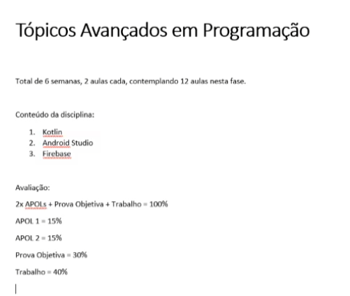

# Tópicos de programação avançada 

## Kotlin x Java
Vantagens: 
- Recursos modernos, como data classes, extension functions e coroutines.
- Segurança aprimorada, por exemplo, por meio do sistema de tipos nulos, evitando NuillPointerExceptions.
- Interoperabilidade total com Java, permitindo o uso de bibliotecas existentes e a migração gradual de projetos.

- Desvantagens:
- Tempo de compilação inicial mais lento.

## Kotlin x React Native (JavaScript)
Vantagens: 
- Desempenho nativo, o Kotlin é compilado para bytecode da JVM, enquanto React Native faz uma ponte com Javascript.
- Maior controle sobre recursos e APIs do sistema operacional. 
- Kotlin é uma linguagem de programação tipada estaticamente, gera menos erros em tempo de execução.

Desvantagens:
- React permite desenvolvimento para Android e iOS em uma única base de código, o que é rápido e econômico para projetos simples.

## Kotlin x Flutter (Dart)
Vantagens: 
- Maior controle sobre recursos e APIs do sistema operacional. 
- Kotlin é a linguagem "principal" da Google para Android

Desvantagens:
- Flutter permite criação de aplicativos tanto para Android quanto iOS
- Flutter possui o Hot Reload, o qual permite aplicar alterações de forma extremamente rápida 

Vamos usar Kotlin e Firebase

### OBS: 
>Apol 1 será baseada nos textos das aulas 1, 2 e 3. E a Apol 2 baseada nos textos das aulas 4, 5 e 6 na rota de estudo. 

Firebase:

https://console.firebase.google.com/u/0/project/_/overview?purchaseBillingPlan=no-cost&hl=pt-br&_gl=1*3nhy15*_ga*MjAxODQ2MDUxOS4xNzIxNzgxMzAw*_ga_CW55HF8NVT*MTcyMTc4MTMwMC4xLjEuMTcyMTc4MTMxMS40OS4wLjA 

